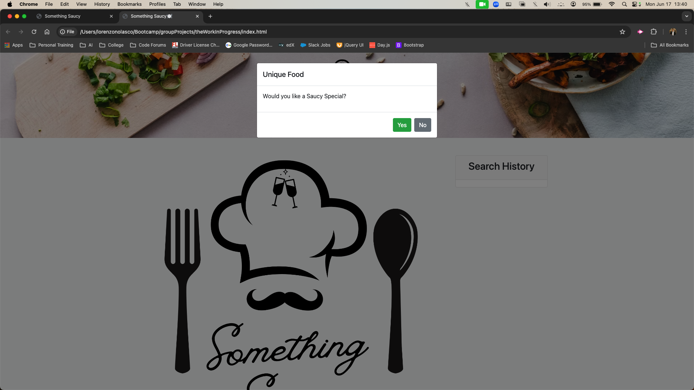
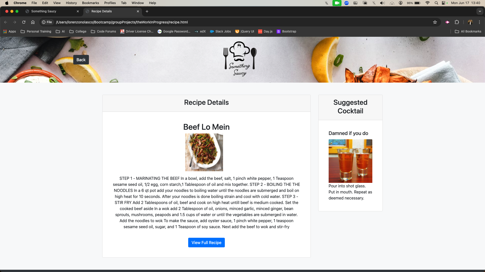
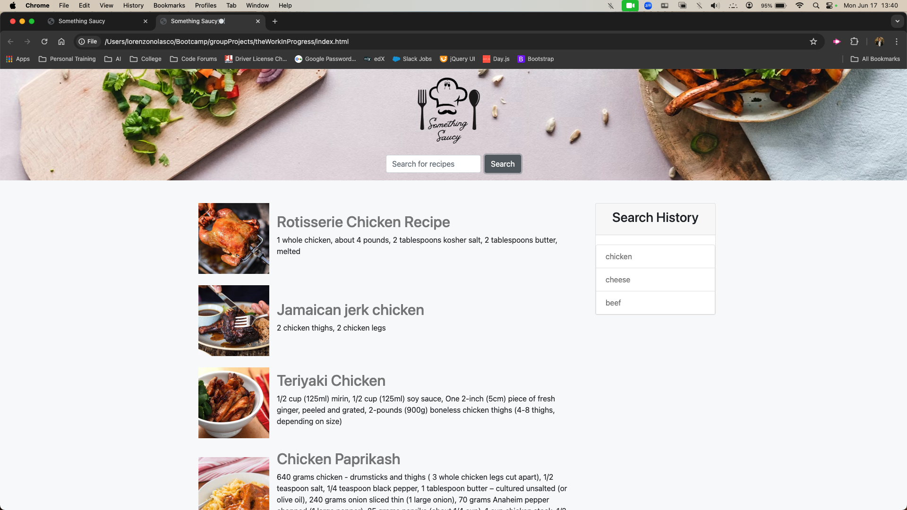
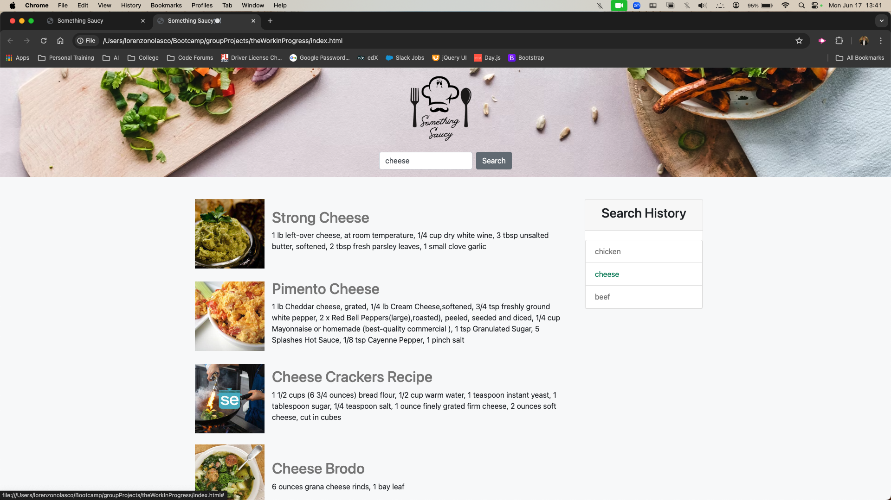

# theWorkInProgress

## Something Saucy

### Description

This website utilizes information from two APIs to generate recipes based on user search input and a random drink selection. A third API is used to generate a random meal recipe if the user clicks yes on the modal prompt.

## Usage

When the user first enters the page a modal will appear asking "would you like a saucy special?" If the user clicks "yes" they will be redirected to a page with a suggested recipe and cocktail. If the user clicks "no" they will be directed to the search page where they may search for recipes. The recipes that appear may be clicked on to redirect the user to a second page that displays the selected recipe along with a suggested cocktail. The second page also displays a "view full recipe" button that will redirect the user to the website that contains the full recipe.

## Credits
Sam Etling   https://github.com/callmecasey
William Hogan   https://github.com/B1LLYBAGZ
Lorenzo Nolasco https://github.com/LorenzoNolasco
Lisa Reynolds   https://github.com/LisaLReynolds